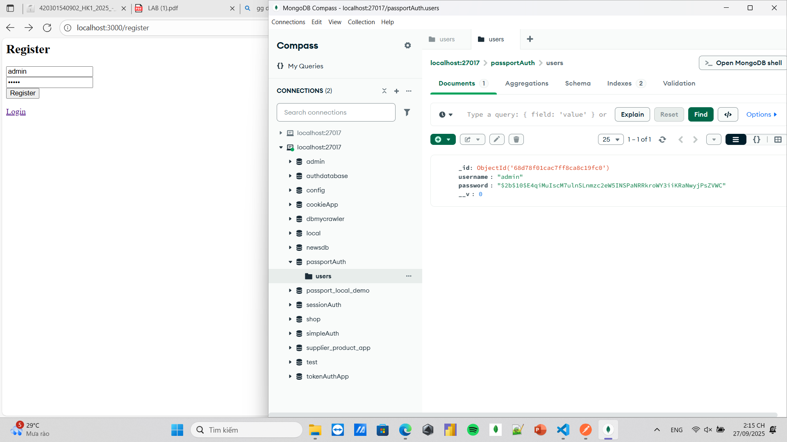
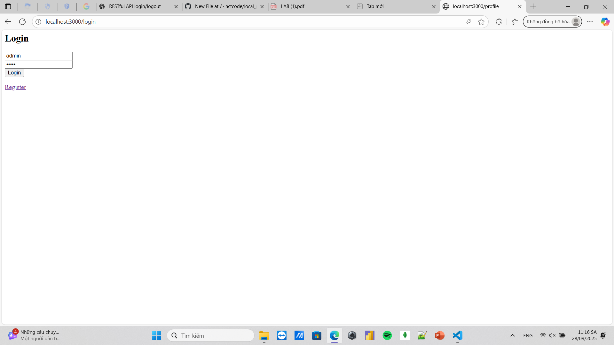
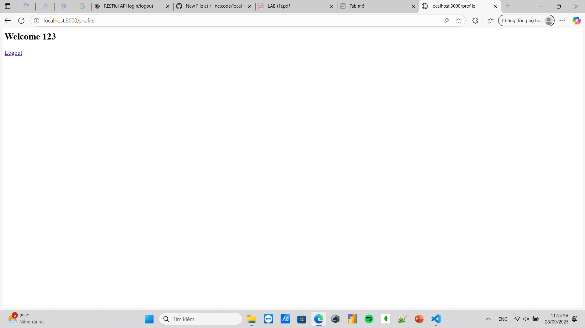

# 🌐 Local Passport Website

Ứng dụng **Website Authentication** sử dụng **Node.js, Express, MongoDB** và **Passport.js (Local Strategy)**.  
Người dùng có thể **đăng ký, đăng nhập, đăng xuất** qua giao diện website được render bằng **EJS**.

---

## 🚀 Công nghệ sử dụng
- **Node.js + Express.js** – Backend framework
- **MongoDB + Mongoose** – Database & ODM
- **Passport.js (Local Strategy)** – Xác thực người dùng bằng email/username + password
- **Bcrypt.js** – Hash mật khẩu
- **Express-session** – Lưu trạng thái đăng nhập
- **EJS + express-ejs-layouts** – Template engine hiển thị giao diện
- **Dotenv** – Quản lý biến môi trường
- **Body-parser** – Xử lý request body

---

## 📂 Cấu trúc thư mục
```bash
local_passport_website/
│── config/
│ └── passport.js # Cấu hình passport local strategy
│── models/
│ └── User.js # Mongoose user schema
│── routes/
│ └── auth.js # Routes cho login, register, logout
│── views/
│ ├── profile.ejs # Layout chính
│ ├── login.ejs # Giao diện đăng nhập
│ ├── register.ejs # Giao diện đăng ký
│── public/
│ └── results/ # Ảnh minh họa
│── app.js # Điểm khởi động chính
│── package.json
│── package-lock.json
│── .gitignore
│── README.md
```

## ▶️ Cách chạy
```bash
# 1. Clone repo
git clone https://github.com/your-username/local_passport_website.git
cd local_passport_website

# 2. Cài dependencies
npm install

# 3. Chạy server
npm start
```

Server sẽ chạy tại: http://localhost:3000

## 🔑 Tính năng chính

✅ Đăng ký tài khoản mới (hash mật khẩu bằng bcrypt)

✅ Đăng nhập qua website (Passport Local Strategy)

✅ Lưu trạng thái đăng nhập bằng session

✅ Đăng xuất (xóa session + cookie)

✅ Giao diện thân thiện với EJS

✅ Bảo vệ route: chỉ người đăng nhập mới vào được dashboard

## 🖼️ Ảnh minh họa
### Trang đăng ký


### Trang đăng nhập


### Trang Dashboard

